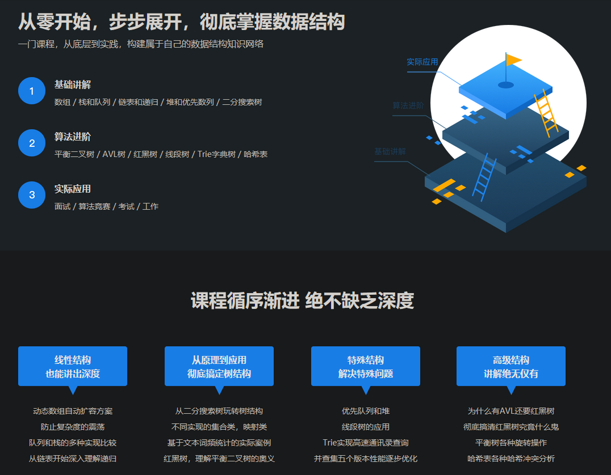

# 用Java玩转数据结构

---

## Intro.简介

Learning Data Structures并不是一个具体的项目，过完这个暑假就大四了，感觉很多基础知识都是一知半解，只懂得很浅层的知识，而且都是碎片，构不成系统的知识框架，所以赶紧提升一下“内力”，跟着课程，并在课程的基础上做一下自己的理解和“负优化”。

## Progress.进度

- [x] Array 数组
- [x] Stack 栈
- [x] Queue 队列
- [x] Linked List 链表
- [x] Binary Search Tree 搜索二叉树
- [x] Set 集合
- [x] Map 映射
- [x] Heap 堆
- [x] Priority Queue 优先队列
- [x] Segment Tree 线段树
- [x] Trie 字典树
- [x] Union Find 并查集
- [x] AVL Tree 平衡二叉树
- [x] Red Black Tree 红黑树
- [x] Hash Table 哈希表

---

## Thanks.鸣谢

- [慕课网](https://coding.imooc.com/class/207.html)